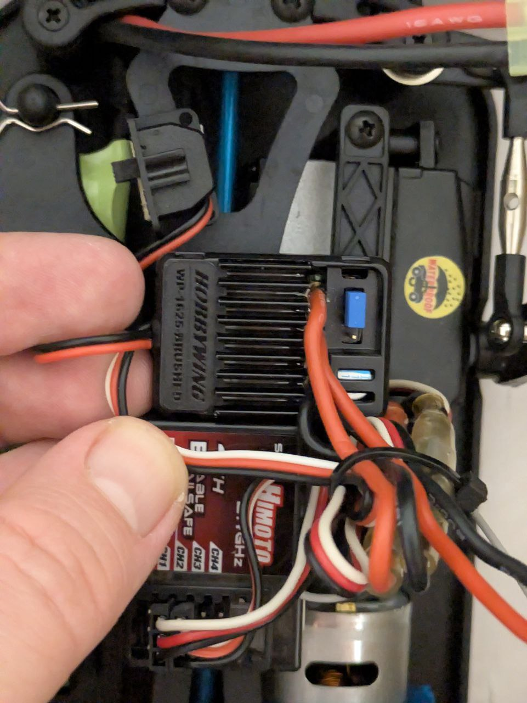
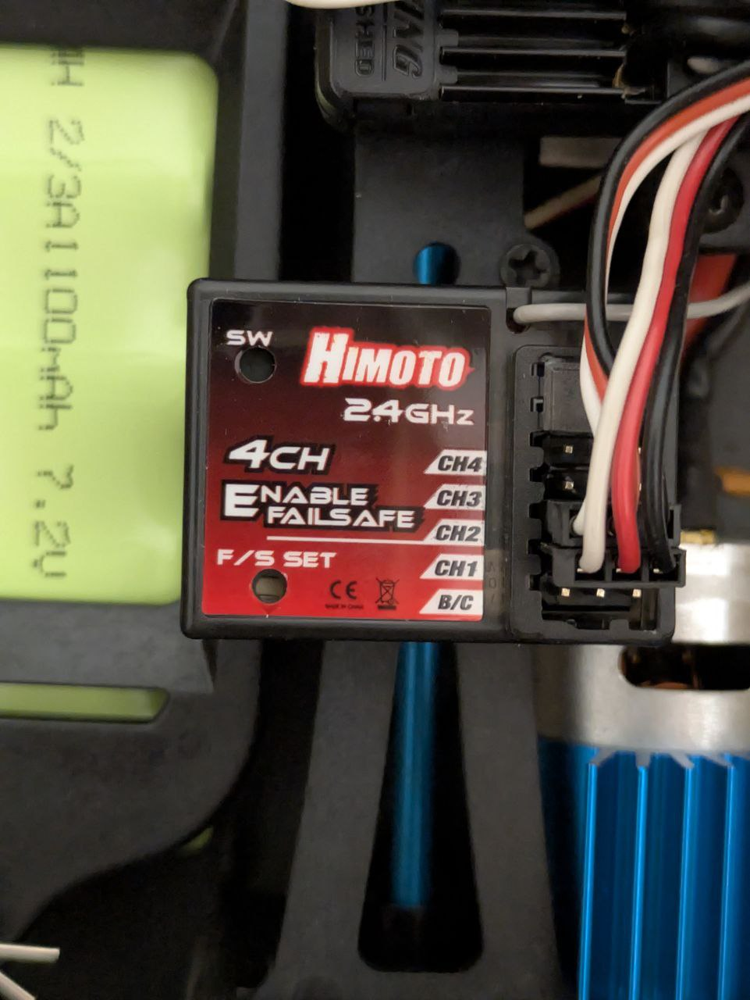

# Пошаговый план работ (без кода) — ретрофит готовой RC‑машины

Цель: получить машину, которая управляется **со смартфона по Wi‑Fi** и **с RC‑пульта**, с телеметрией IMU и безопасным поведением при потере связи.
Термины/сокращения: см. `docs/glossary_ru.md`.

## 0) До покупки базы (самое важное)
- Открыть `docs/car_candidates_ru.md` и выбрать 1–2 семейства, которые вам нравятся по типу (краулер/пикап/шорт‑корс).
- Принять стратегию:
  - **Ветка A (выбрана)**: база должна позволять управлять штатным регулятором (ESC) и рулевым сервоприводом через **классический PWM** (как от обычного RC‑приёмника).
  - **Ветка B (план‑B)**: если выяснится, что штатная плата не имеет стандартных входов/разъёмов и "врезаться" в PWM нельзя — готовим замену электроники на стандартные узлы.

## 1) Закупка электроники (параллельно с покупкой машинки)
- По списку из `docs/bom_ru.md`.
- Сверить общий бюджет по `docs/budget_ru.md` (особенно если добавляете RC‑пульт+приёмник).

### Статус закупки (см. `docs/bom_ru.md`)
✅ **Уже куплено:**
- ESP32‑S3 Zero mini — основной контроллер (Wi‑Fi + PWM + IMU)
- MPU‑6500 — IMU (акселерометр + гироскоп)
- BEC ReadyToSky 2–6S 5V/12V 3A — источник питания
- RP2040 (Raspberry Pi Pico Black Board) — резервный/дополнительный контроллер

❌ **Осталось купить:**
- Конденсаторы для стабилизации 5V (470–1000µF + 0.1µF)
- Соединители и проводка (servo разъёмы, JST, провода Dupont, термоусадка, стяжки)
- Делители напряжения (если RC‑приёмник выдаёт 5V сигналы)
- Мультиметр (желательно)
- Двусторонний скотч/липучка

## 2) Первичная диагностика после покупки (10–15 минут)
- Снять кузов и зафиксировать:
  - есть ли **отдельный рулевой сервопривод** (3 провода)?
  - мотор **brushed (2 провода)** или **brushless (3 провода)**?
  - есть ли понятные разъёмы / возможность подать PWM на газ/руль?
  - как организовано питание (есть ли BEC 5V и где его брать)?

Результат: окончательно выбрать ветку **A** или **B**.

### Результат диагностики по Himoto SCT‑16 (по фото)
- Есть отдельный **RC‑приёмник Himoto 2.4GHz 4CH** с обычными 3‑pin разъёмами `CH1..CH4` → это означает **стандартный PWM** и хорошую совместимость с веткой A.
- Отдельный ESC установлен отдельно от приёмника (не “комбо‑плата”) → проще “врезаться” между приёмником и ESC/серво.

#### Фото (в репозитории)
Сложите диагностические фото в `docs/media/` и используйте эти имена:
- `docs/media/himoto_sct16_internals_esc_rx.jpg` — ESC + общая компоновка
- `docs/media/himoto_sct16_receiver_ch.jpg` — приёмник Himoto 4CH (CH1..CH4)

Ссылки (начнут отображаться, когда файлы будут добавлены в репозиторий):
- 
- 

## 3) Электрическая интеграция
### Ветка A
- Подать PWM с **ESP32‑S3** на штатный ESC и рулевой сервопривод (или на входы `THR/STR`, если они есть).
- ESP32‑S3 генерирует PWM сигналы для ESC (газ) и серво (руль).
- Подключить **BEC ReadyToSky** к батарее 2S, выставить режим 5V.
- Питать ESP32‑S3 от BEC (5V).
- Добавить конденсаторы на шину 5V (470–1000µF + 0.1µF) для стабилизации.

### Ветка B
- Заменить штатную плату на стандартные узлы:
  - ESC (brushed или brushless — по вашему мотору) + BEC 5V
  - (при необходимости) рулевой сервопривод

## 4) Два источника управления
- **Wi‑Fi управление**: телефон → ESP32‑S3 Zero mini (AP/точка доступа) → внутренняя обработка.
- **RC управление**: RC‑приёмник → ESP32‑S3 (PWM входы через Input Capture, при необходимости через делители напряжения если сигнал 5V).
- Задать правило приоритета и безопасный таймаут (failsafe) — см. `docs/interfaces_protocols.md`.
- Примечание: ESP32‑S3 работает на 3.3V логике, поэтому если RC‑приёмник выдаёт 5V PWM, нужны делители напряжения или level‑shifter.

## 5) IMU
- Установить **MPU‑6500** (или ожидаемый LSM3DS3/ICM‑20948) на шасси жёстко (минимум вибраций), согласовать оси.
- Подключить датчик к ESP32‑S3 по I2C или SPI (предпочтительно SPI для высокой частоты).
- Для начала достаточно: чтение accel/gyro и вывод в телеметрию через Wi‑Fi; дальше можно добавлять режимы стабилизации.
- Примечание: датчики работают от 3.3V, можно питать от 3.3V с ESP32‑S3 или от 5V шины (зависит от модуля).

### 5.1) Магнитометр / 9-DOF IMU (опционально, для компенсации yaw drift)

**Основной вариант — LSM3DS3 (ожидается):**
- **Датчик:** LSM3DS3 (6‑DOF: акселерометр + гироскоп)
- **Назначение:** основной IMU (замена MPU‑6500), измерение ускорений и угловых скоростей
- **Подключение:** I2C или SPI к ESP32‑S3 (предпочтительно SPI для высокой частоты)
- **Размещение:** как можно дальше от мотора/ESC/силовых проводов (минимизировать вибрации)
- **Калибровка:** статическая калибровка акселерометра и гироскопа
- **Интеграция:** драйвер `Lsm3ds3Driver` для ESP32‑S3
- **Статус:** задача в `docs/tasks.md` (TASK-RC-001), ожидается поставка
- **Примечание:** 6-DOF без магнитометра — yaw будет дрейфовать без дополнительной компенсации

**Альтернатива — ICM‑20948 (ожидается):**
- **Датчик:** ICM‑20948 (9‑DOF: акселерометр + гироскоп + магнитометр)
- **Назначение:** полная замена MPU‑6500/LSM3DS3, компенсация дрейфа yaw, абсолютный heading
- **Подключение:** I2C или SPI к ESP32‑S3
- **Статус:** задача в `docs/tasks.md` (TASK-RC-002)

**Резервный вариант — MMC5983MA (если нужен отдельный магнитометр):**
- **Датчик:** MMC5983MA (3-осевой магнитометр) в паре с LSM3DS3
- **Назначение:** компенсация дрейфа yaw ( LSM3DS3 остаётся для accel/gyro)
- **Преимущество:** более высокая частота магнитометра (1000 Гц)
- **Статус:** задача в `docs/tasks.md` (TASK-RC-003)

Если вы целитесь в **устойчивость/контроль заноса**, то на практике потребуется:
- высокая частота чтения IMU и управления (ориентир: 200–500 Гц для контуров по gyro),
- хорошие шины/подвеска (это "бесплатная" стабильность),
- (опционально, но сильно помогает) датчики скорости колёс/одометрия, если захочется контролировать пробуксовку, а не только рыскание.

## 5.1) Телеметрия: сбор/отправка в платформу (за пределами web‑пульта)
- Договориться о формате сигналов и метаданных: см. `docs/telemetry-rc-stm32.md`.
- Использовать отдельный агент опроса/отправки телеметрии (**уже есть**): `projects/telemetry_cli` (см. также `docs/telemetry-cli-ts.md`).
- Заложить сценарии:
  - онлайн-стриминг (в реальном времени);
  - **догрузка после эксперимента** (часть данных копится на устройстве и выгружается в конце);
  - синхронизация времени между датчиками/группами датчиков (например, по тегу/label).

## 5.2) IMU / магнитометр (интеграция в процессе)
- Основная задача: `docs/tasks.md` (TASK-RC-001 — LSM3DS3, 6-DOF IMU)
- Альтернатива: `docs/tasks.md` (TASK-RC-002 — ICM‑20948, 9-DOF IMU)
- Дополнение: `docs/tasks.md` (TASK-RC-003 — MMC5983MA, магнитометр)
- Требуется: закупка/поставка датчика, драйвер, калибровка, AHRS
- Ожидаемый результат: измерение ускорений/угловых скоростей, компенсация дрейфа yaw (с магнитометром)

## 6) (Опционально, позже) Датчики скорости колёс
- Заложить места под датчики заранее: где можно закрепить магнит и датчик (на кардане/спуре/ступице), чтобы проводка не цеплялась за подвеску.
- Начать можно с **1 датчика** (общая “скорость”), а затем расширить до 2–4 датчиков (по колёсам) — это уже даёт основу для контроля пробуксовки.

## 6.1) (Опционально) Оптический датчик “скорости по земле” (PMW3901/аналоги)
Идея: получить оценку скорости/смещения **по поверхности**, что особенно полезно для одометрии и детекта **пробуксовки** (когда скорость по колёсам “врёт”).

### Железо
- Flow‑сенсор (PMW3901 или аналог) ставится **строго вниз** и жёстко крепится к шасси.
- (Рекомендуется) ToF вниз (VL53L1X/VL53L0X) рядом — для измерения высоты до поверхности и пересчёта optical flow в м/с.
- Обязательное: защита от грязи/пыли (кожух, окно), иначе качество резко падает.

### Подключение
- PMW3901 обычно по **SPI** (3.3V логика): `SCK/MOSI/MISO/CS` + `GND` + `3V3`.
- ToF обычно по **I2C**: `SDA/SCL` + питание.
- Важно: не тянуть тонкими “логическими” проводами питание рядом с силовыми проводами мотора/сервы.

### Быстрые проверки (без калибровок)
- На месте: поднять машину над столом на рабочую высоту, пошевелить её влево/вправо и вперёд/назад — убедиться, что в телеметрии появляются ненулевые dX/dY.
- В темноте/с плохой текстурой поверхности могут быть нули/шум — это нормально, лечится освещением/подсветкой/выбором покрытия.

### Мини-калибровка на практике
- Проехать “по линейке” (например 2–5 метров по полу) и подстроить коэффициент пересчёта скорости (если без ToF).
- Если есть ToF: проверить, что высота адекватно меняется на кочках/подвеске, и скорость по optical flow меньше зависит от просадки подвески.

## 7) Тесты безопасности (обязательно)
- Потеря Wi‑Fi → газ в ноль/нейтраль.
- Потеря RC → газ в ноль/нейтраль.
- Переключение источников управления → без рывка/без “внезапного газа”.
